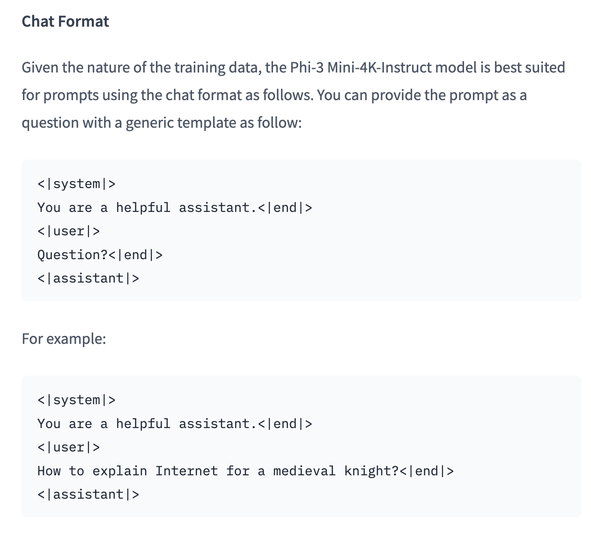

# Huggingface
- **정의**
  - **Hugging Face**는 자연어 처리(NLP)와 머신러닝 분야에서 가장 영향력 있는 오픈소스 플랫폼
  - **Transformers 라이브러리**를 개발하여 BERT, GPT, T5 등 트랜스포머 기반 모델의 표준 구현체 제공
  - **Hugging Face Hub**를 통해 50만개 이상의 사전 훈련된 모델과 데이터셋을 공유하는 세계 최대 AI 커뮤니티 플랫폼
  - **Inference API**를 통해 클라우드에서 모델을 쉽게 배포하고 사용할 수 있는 서비스 제공
  - **Datasets 라이브러리**로 대규모 데이터셋 처리와 공유를 위한 도구 제공
  - **Spaces**를 통해 AI 애플리케이션을 쉽게 배포하고 공유할 수 있는 플랫폼 제공
  - **Accelerate** 라이브러리로 분산 학습과 추론을 위한 도구 제공 

## Serverless Endpoints
- LLM 중에서 Inference API를 제공하는 경우 무료로 사용이 가능하다. 
- [Inference Endpoints](https://huggingface.co/docs/inference-endpoints/index)
  
#### 사용 예시
* [Phi-3-mini-4k-instruct](https://huggingface.co/microsoft/Phi-3-mini-4k-instruct)
```python
import os
from langchain_core.output_parsers import StrOutputParser
from langchain_huggingface import HuggingFaceEndpoint

# Inference API를 제공하는 모델 repository name 선택
repo_id = "microsoft/Phi-3-mini-4k-instruct" 

llm = HuggingFaceEndpoint(
    repo_id=repo_id,
    max_new_tokens=256,
    temperature=0.1,
    task="text-generation",
    huggingfacehub_api_token=os.environ["HUGGINGFACEHUB_API_TOKEN"], # My API Token
)
```

단, chain 생성 이후 임의 Format으로 질의를 할 경우 매우 품질 낮은 답변을 할 수 있음  
각 모델의 Format을 확인 하고, 확인한 Format대로 질의를 해야 함  
모델의 Format은 모델 상세 페이지에 있음


```python
format = """
  <|system|>
  You are a helpful assistant.<|end|>
  <|user|>
  {question}<|end|>
  <|assistant|>
"""
```

## Dedecated Endpoint
- 원하는 모델을 선택
- 원하는 Cloud service 선택(AWS, azure, ...)
- 호스팅 가능
- Scale-to-Zero도 가능 : 비용 절감에 효율적
- 마찬가지로 모델마다 작성되어있는 Prompt Template를 지켜주는게 좋음

종합하자면, 원하는 클라우드 서비스의 원하는 원격 서버에 원하는 모델을 올려서 시간당 요금 내면서 사용할 수 있는데  
사용량이 없으면 아예 서버를 내려놓을 수 있어서 시간당 비용을 절감할 수 있음

```python
endpoint_url = "Dedecated Endpoint로 생성한 url 주소"
prompt = "모델 설명에서 제시하는 prompt"

llm = HuggingFaceEndpoint(
    endpoint_url=hf_endpoint_url,
    max_new_tokens=512,
    temperature=0.01,
    task="text-generation",
)

chain = prompt | llm
chain.invoke({"question":"blablablablabla..."})
```

## HuggingFace Local Model
- Local PC에 HuggingFace에서 제공하는 모델을 받아서 실행
- GPU 성능이 매우 중요
  - Window의 경우 GPU에 쿠다 설정이 되어있어야 활용 가능

#### 1. 경로 설정
```python
import os

# 임의 경로 : 경로를 지정해주는게 나중에 모델 지우기 편함. 안그러면 용량이 너무 금방 차버림
os.environ["TRANSFORMERS_CACHE"] = "./cache/"
os.environ["HF_HOME"] = "./cache/"
```
#### 2. 다운로드
```Python
from langchain_huggingface import HuggingFacePipeline

llm = HuggingFacePipeline.from_model_id(
    model_id="microsoft/Phi-3-mini-4k-instruct",
    task="text-generation",
    pipeline_kwargs={
        "max_new_tokens": 256,
        "top_k": 50,
        "temperature": 0.1,
    },
)

llm.invoke("Hugging Face is")
```
# test