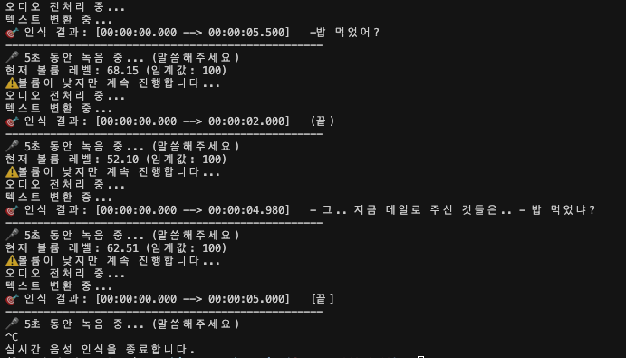

### faster_whisper를 통해서 whisper.cpp의 large-v2를 받아서 처리

* 여러 모델을 테스트 해본 결과 large-v2가 가장 괜찮음
* 오프라인 상태에서 돌려야해서 모델을 받아서 캐싱해둔 모델을 지속적으로 사용하게 설정
* 대신 최초 1회는 온라인 상태여야 함 : 모델을 받기 위함
* 나름의 튜닝
>
```python
model.transcribe(
    temp_wav_path, 
    language="ko",
    # 노래 인식을 위한 최적화된 파라미터들
    beam_size=5,  # 더 정확한 인식을 위해 증가
    best_of=5,    # 더 많은 후보 검토
    temperature=0.0,  # 결정적 결과 유지
    condition_on_previous_text=True,  # 이전 텍스트 고려
    initial_prompt="",  # 초기 프롬프트 추가
    word_timestamps=False,  # 단어별 타임스탬프 비활성화
    vad_filter=True,  # VAD 필터 활성화
    vad_parameters=dict(
        min_silence_duration_ms=1000,  # 1초로 증가 (노래 중간 휴식 허용)
        speech_pad_ms=300  # 0.3초로 감소
    ),
    # 노래 인식을 위한 임계값 조정
    compression_ratio_threshold=2.4,  # 압축 비율 임계값
    no_speech_threshold=0.3,  # 무음 임계값 낮춤 (0.6 → 0.3)
    # 반복 패널티 완화
    repetition_penalty=0.8,  # 반복 패널티 완화 (1.0 → 0.8)
    length_penalty=1.0,  # 길이 패널티 유지
    # 추가 옵션
    suppress_tokens=[-1],  # EOT 토큰 억제
    without_timestamps=False,  # 타임스탬프 유지
    max_initial_timestamp=1.0,  # 초기 타임스탬프 최대값
)
```
>

* 당연히 음성 퀄리티가 좋고 발음이 정확하면 신뢰도가 높지면 보통 수준의 값이 자주 나옴
* 특히 음성이 겹치거나 노래의 반복되는 부분같은 경우는 감지를 못하는 경우가 발생함

#### 신뢰도 해석 가이드

| 신뢰도 범위 | 의미 | 권장사항 |
|------------|------|----------|
| -0.1 ~ 0.0 | 매우 높음 | 결과를 신뢰할 수 있음 |
| -0.3 ~ -0.1 | 높음 | 대부분 정확함 |
| -0.6 ~ -0.3 | 보통 | 검토 권장 |
| -1.0 ~ -0.6 | 낮음 | 수동 검토 필요 |
| -1.0 이하 | 매우 낮음 | 재녹음 또는 다른 방법 고려 |

---

### Whisper.cpp로 실시간 음성 변환 결과
* [실시간 변환 코드](./speech_to_text_whisper.cpp.py)
* 결과

